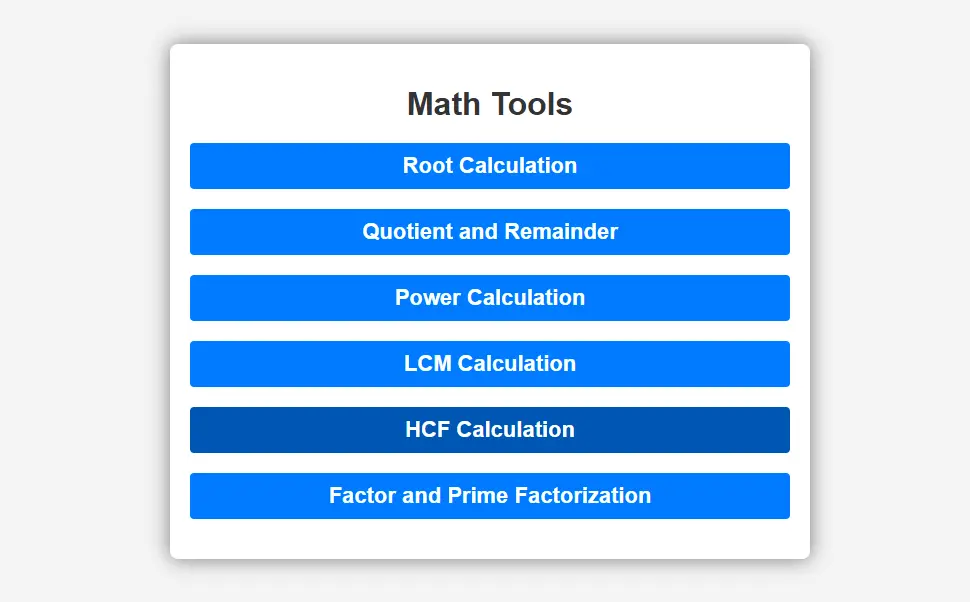

# Math Tools

A user-friendly web application that provides various mathematical calculation tools. This interactive calculator suite offers multiple mathematical operations through a clean and intuitive interface.

## Screenshot

## Features

The application includes the following calculation tools:

1. **Root Calculation**
   - Calculate nth root of a number
   - Adjustable root value from 2 to 10 using a slider
   - Supports decimal numbers

2. **Quotient and Remainder**
   - Calculate both quotient and remainder for division operations
   - Handles decimal numbers
   - Shows results simultaneously

3. **Power Calculation**
   - Calculate powers with any base and exponent
   - Supports decimal numbers
   - Precise calculations using JavaScript Math.pow()

4. **LCM (Least Common Multiple)**
   - Calculate LCM for multiple numbers
   - Input numbers as comma-separated values
   - Handles any number of inputs

5. **HCF (Highest Common Factor)**
   - Calculate HCF/GCD for multiple numbers
   - Input numbers as comma-separated values
   - Efficient calculation using Euclidean algorithm

6. **Factor and Prime Factorization**
   - Find all factors of a number
   - Calculate prime factorization
   - Display results in an easy-to-read format

## Getting Started

### Prerequisites
- A modern web browser
- No additional installations required

### Installation
1. Clone this repository or download the files
2. Open `index.html` in your web browser

## Usage

1. Click on any tool's header to expand it
2. Enter the required numbers in the input fields
3. Click "Calculate" to see the results
4. Use "Clear" to reset the inputs and results

## Technical Details

The application is built using:
- HTML5
- CSS3
- Vanilla JavaScript

Key features include:
- Responsive design
- Interactive UI with expandable/collapsible sections
- Real-time input validation
- Clean and modern interface
- Efficient calculations using optimized algorithms

## File Structure
├── index.html # Main HTML file
├── styles.css # CSS styling
└── script.js # JavaScript functionality

## Contributing

Feel free to fork this project and submit pull requests for any improvements.

## License

This project is open source and available under the MIT License.

